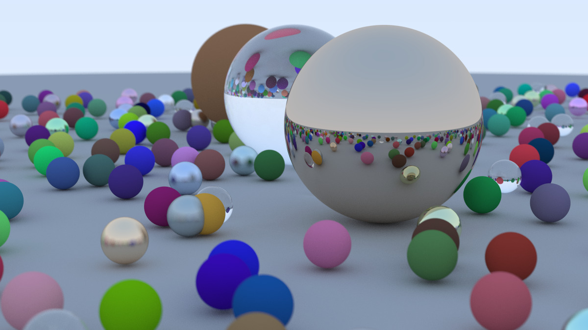
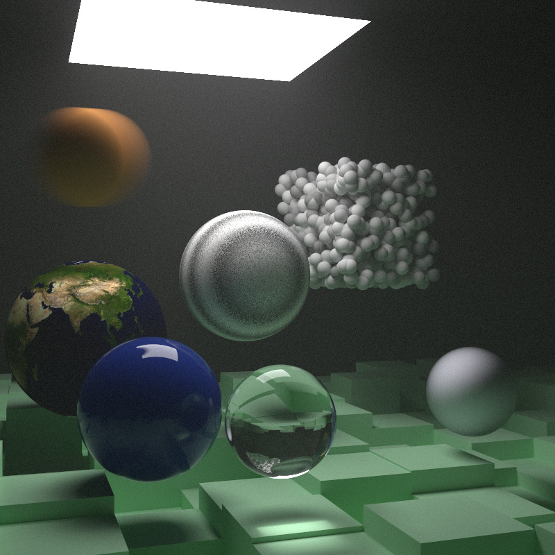

# Ray Tracer

A ray tracer implementing the full _Ray Tracing in One Weekend_ + _Ray Tracing: The Next Week_ series, written in C++ with a WebGPU/WGSL compute path.

---

<p align="center">
  
  <br>
  <em>Ray Tracing in One Weekend — final scene</em>
</p>

<p align="center">
  
  <br>
  <em>Ray Tracing: The Next Week — final scene</em>
</p>

---

## Features

- BVH acceleration structure
- Volumetric rendering
- Image textures
- Perlin noise
- Motion blur
- Instance transforms
- Dual render path (CPU and GPU)
- Materials: diffuse, diffuse light, metal, dielectric
- Anti-aliasing
- Positionable camera
- Depth of field (defocus blur)
- Sphere, quadrilateral primitives

## Technical notes

**Iterative BVH traversal**: WGSL has no recursion, so the BVH traversal (usually recursive) had to be rewritten iteratively, with the tree flattened into arrays.

**GPU scene construction**: Used a Visitor pattern to flatten the CPU-side BVH tree into arrays.

## Dependencies

Both vendored under `src/external` — no separate download needed.

- [wgpu-native](https://github.com/gfx-rs/wgpu-native) — WebGPU implementation
- [stb_image](https://github.com/nothings/stb) — image loading (textures)

## Build & Run

**Requirements:**

- C++23-compatible compiler (MSVC, Clang, GCC, or AppleClang)
- CMake >= 3.30
- CMake compatible build system
- Linux only: Vulkan SDK / dev packages installed

```bash
git clone https://github.com/rampathak-dev/RayTracer.git
cd RayTracer

cmake -S . -B build
cmake --build build --config Release

# Run the executable from the build directory
```

Only release binaries for wgpu-native are vendored in this repo. Building in Debug requires sourcing your own debug wgpu-native binary from the [official releases page](https://github.com/gfx-rs/wgpu-native/releases) and placing it in the matching `src/external/WGPU/<platform>/<arch>/debug/` folder.
